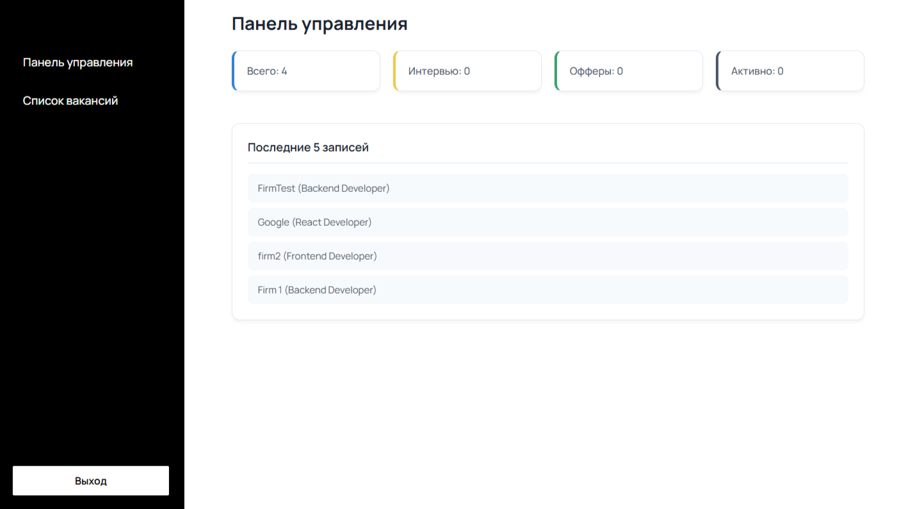
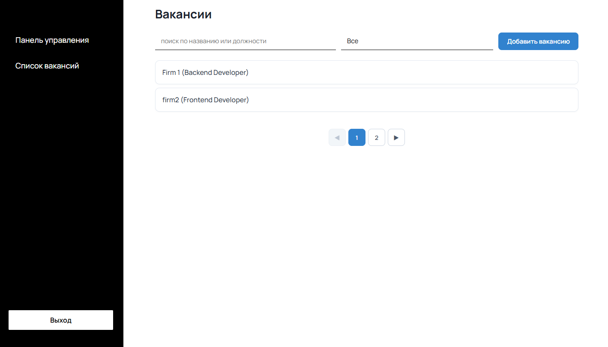
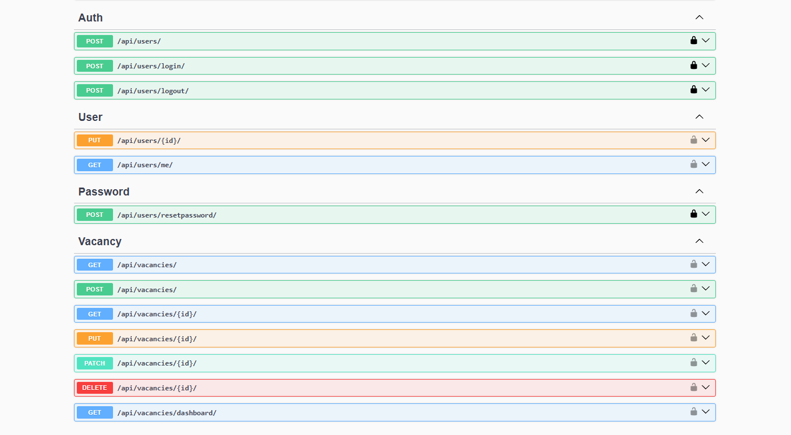

# Job Tracker

Веб-приложение для отслеживания откликов на вакансии.

## Возможности

- Регистрация и авторизация
- Подтверждение электронной почты
- Смена и восстановление пароля
- Dashboard со статистикой
- CRUD вакансий
- Поиск, фильтрация и пагинация
- Swagger-документация API

---

## Скриншоты

### Dashboard



### Список вакансий



### Swagger



---

## Стек

### Backend

- Django
- Django REST Framework
- PostgreSQL
- SimpleJWT
- drf-spectacular

### Frontend

- React
- TypeScript
- RTK Query
- React Router
- Material UI

---

## Запуск

### Backend

```bash
pip install -r requirements.txt
cd backend
python manage.py migrate
python manage.py runserver
```

### Frontend

```bash
cd frontend
npm install
npm run dev
```

---

## Документация API

```
/api/docs/
```